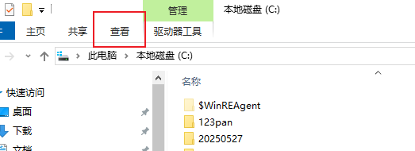
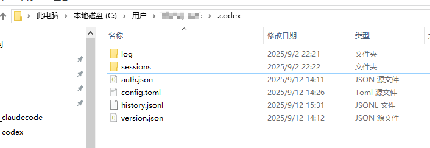
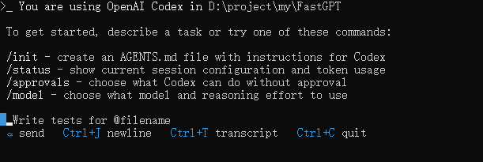
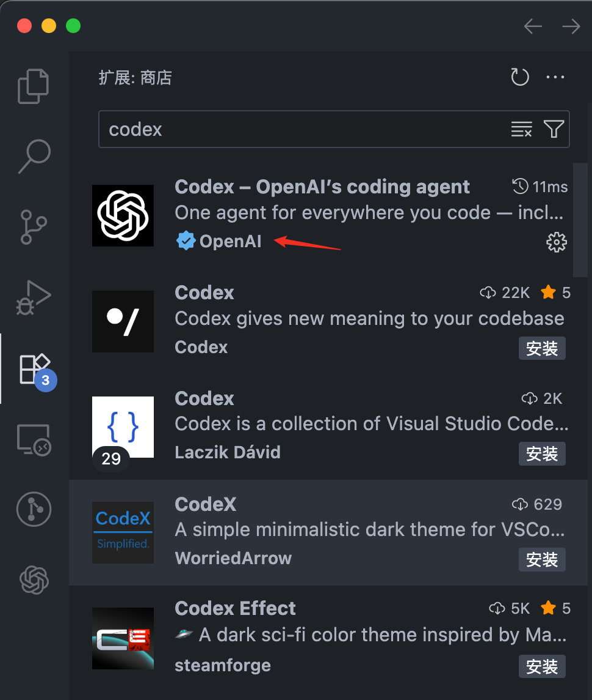
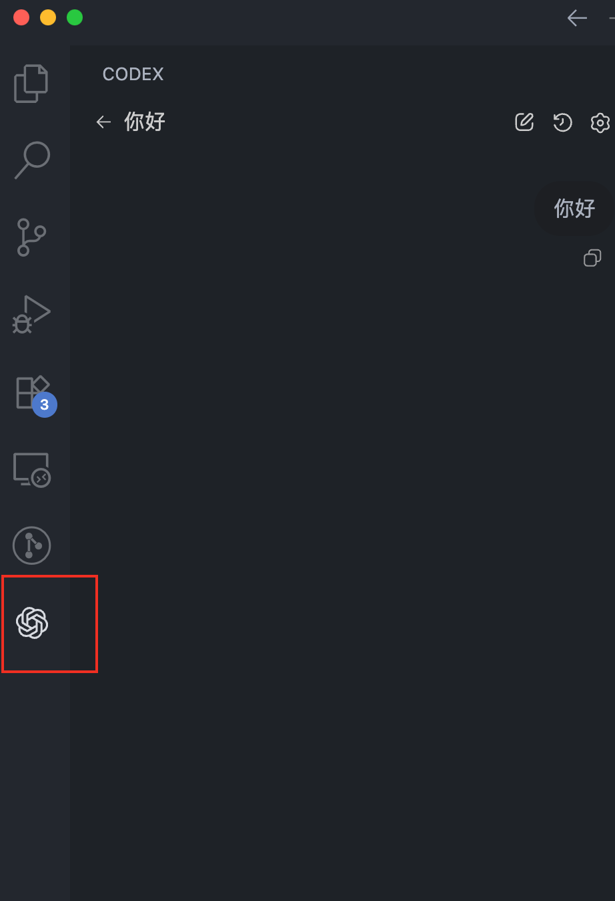
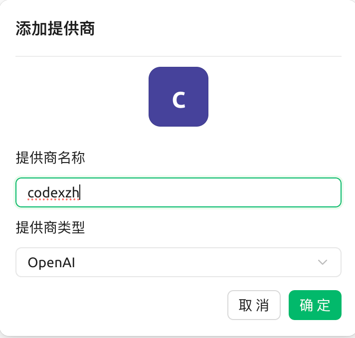
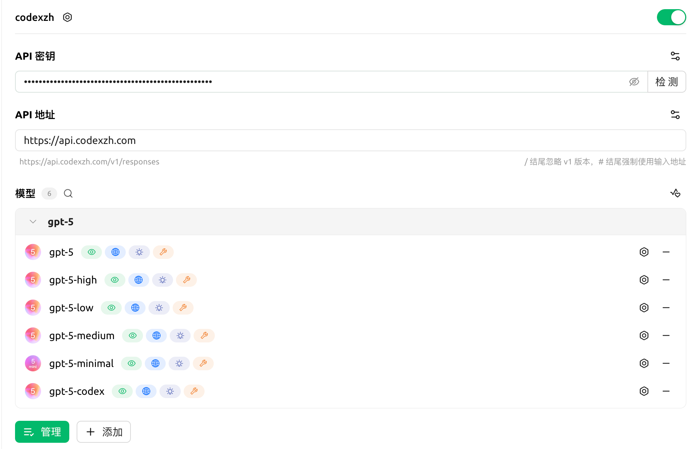

# 🚀 Codex cli 和 codex 官方插件国内使用教程

> 让 AI 成为你的编程伙伴，体验前所未有的编程效率提升！

**Codex** 是一个强大的 AI 编程助手服务，提供最新的 GPT-5 和 GPT-5-Codex 模型支持，帮助开发者提升编程效率，解决复杂编程问题。

## 📋 目录

- [特性介绍](#-特性介绍)
- [快速开始](#-快速开始)
- [安装配置](#️-安装配置)
  - [Windows 用户](#️-windows-用户)
  - [macOS 用户](#-macos-用户)
- [VSCode 扩展配置](#-vscode-扩展配置)
- [第三方平台集成](#-第三方平台集成)
- [实用技巧](#-实用技巧与命令)
- [常见问题](#️-常见问题解决方案)
- [版本升级注意事项](#-版本升级注意事项)
- [图片资源说明](#-图片资源说明)

## ✨ 特性介绍

- 🤖 **最新 AI 模型**：支持 GPT-5 和 GPT-5-Codex 模型
- 💻 **多平台支持**：Windows、macOS 完美兼容
- 🔧 **VSCode 集成**：官方扩展，无缝开发体验
- 🌐 **第三方平台**：兼容 Cherry 等主流 AI 平台
- ⚡ **高推理强度**：支持复杂编程问题解决
- 🛡️ **稳定可靠**：专业级服务保障

**官方网站**：[www.codexzh.com](https://www.codexzh.com)  
**技术参数**：`model_provider=codexzh` | `base_url=https://api.codexzh.com`

## 🚀 快速开始

### 前置条件

- ✅ Node.js 22+ 
- ✅ npm 10+
- ✅ 稳定的网络连接
- ✅ CodexZH 账户和 API 密钥

### 激活流程

1. **注册账户**：访问 [www.codexzh.com](https://www.codexzh.com) 使用邮箱注册
2. **激活套餐**：输入激活码或直接购买套餐
3. **获取密钥**：复制以 `sk-` 开头的 API 密钥
4. **安装配置**：按照下方教程配置开发环境

## ⚙️ 安装配置

### 🖥️ Windows 用户

#### 环境检查

确保系统满足以下要求：
- Windows 10 或更新版本
- Node.js 22+
- npm 10+

#### 安装 Codex 客户端

```bash
npm install -g @openai/codex
```

验证安装：
```bash
codex --version
```

#### 配置文件设置

1. 找到用户目录下的 `.codex` 文件夹：`C:\Users\你的用户名\.codex`

2. 如果看不到隐藏文件夹，需要在文件管理器里开启"显示隐藏的项目"

   

3. 如果没有 `.codex` 文件夹，创建一个，然后新建两个文件：`config.toml` 和 `auth.json`

   

4. **编辑 config.toml 文件：**

```toml
model_provider = "codexzh"
model = "gpt-5"  # 想体验新功能？改成 "gpt-5-codex"
model_reasoning_effort = "high"
disable_response_storage = true

[model_providers.codexzh]
name = "codexzh"
base_url = "https://api.codexzh.com/v1"
wire_api = "responses"
requires_openai_auth = true
```

5. **编辑 auth.json 文件：**

```json
{
    "OPENAI_API_KEY": "sk-你的实际密钥"
}
```

🔥 **重要提醒**：记得把 `sk-你的实际密钥` 替换成你的真实密钥！

#### 启动测试

配置完成后，重启命令行，然后进入项目目录：

```bash
codex
```

如果一切顺利，你会看到 Codex 成功启动的界面：



### 🍎 macOS 用户

#### 环境准备

确保 Mac 具备以下条件：
- Node.js 22+
- npm 10+
- 良好的网络环境

#### 安装过程

打开终端，运行安装命令：

```bash
npm install -g @openai/codex
```

Homebrew 用户也可以：

```bash
brew install codex
```

验证安装：

```bash
codex --version
```

#### 配置设置

1. 回到用户主目录：

```bash
cd ~
```

2. 检查是否存在 `.codex` 文件夹：

```bash
ls -la
```

3. 如果没有，创建必要的文件：

```bash
mkdir .codex
cd .codex
touch config.toml auth.json
```

4. 用编辑器打开配置文件：

```bash
code .
```

配置内容和 Windows 版本相同，参考上方配置文件内容。

## 📦 VSCode 扩展配置

### 安装官方扩展

在 VSCode 扩展商店搜索并安装 **OpenAI ChatGPT** 官方扩展。

⚠️ **注意**：认准带有 OpenAI 官方认证标识的扩展！



安装完成后，左侧会出现新的图标：



### 扩展配置

如果扩展无法正常工作，需要在 VSCode 设置中搜索 `@ext:openai.chatgpt`，点击"在 settings.json 中编辑"，添加配置：

```json
"chatgpt.apiBase": "https://api.codexzh.com/v1",
"chatgpt.config": {
  "preferred_auth_method": "apikey",
  "model": "gpt-5",
  "model_reasoning_effort": "high",
  "wire_api": "responses"
}
```

保存后重启 VSCode 即可使用。

## 🔌 第三方平台集成

### 通用接口说明

CodexZH 提供标准的 OpenAI 兼容接口：

- **接口地址**：`/v1/chat/completions`
- **认证方式**：Bearer Token
- **Base URL**：`https://api.codexzh.com`

### Cherry 平台集成示例

在模型服务中添加新供应商：



**配置参数：**
- API 密钥：你的 `sk-` 开头的密钥
- API 地址：`https://api.codexzh.com`
- 可用模型：`gpt-5`、`gpt-5-codex`

配置完成后的效果：



> 💡 **友情提醒**：如果要接入 new-api 等平台，建议先和客服打个招呼，说明用途，避免被系统误判！

## 🎮 实用技巧与命令

### 快捷命令大全

```bash
/mode       # 切换工作模式（建议/自动编辑/完全自动化）
/model      # 更换AI模型和推理强度
/approvals  # 调整权限级别（只读/自动/完全访问）
/init       # 创建项目配置文件 AGENTS.md
/status     # 查看当前会话状态和使用情况
/diff       # 显示代码变更对比
/clear      # 清空聊天记录
/prompts    # 获取提示词建议
/help       # 显示帮助信息
```

### 模型选择建议

- **gpt-5**：支持可视化编辑器，有完整的变更列表，推荐用于文件编辑
- **gpt-5-codex**：最新功能体验，适用于代码生成和优化

### 更多学习资源

想深入了解？访问 [官方文档](https://developers.openai.com/codex/cli/) 获取更多高级用法！

## 🛠️ 常见问题解决方案

### 错误代码 401

**可能原因**：配置信息不匹配

**解决方案**：
1. 检查 base_url 和密钥是否正确对应
2. 排查环境变量是否有冲突
3. 确认账户已激活且订阅有效
4. 验证密钥复制是否完整准确

### 连接中断错误

**错误信息**：`stream error: stream disconnected before completion`

**可能原因**：
- AI 思考时间过长（超过150秒会被系统截断）
- 网络连接不稳定

**解决方案**：
- 等待官方优化思考时间限制
- 检查网络代理设置是否稳定

### 路径错误

**错误信息**：`Unable to persist auth file: 系统找不到指定的路径`

**解决方案**：搜索并删除多余的 codex 文件夹，按照本教程重新配置

### 请求发送失败

**错误信息**：`stream error: error sending request for url`

**解决方案**：
1. 尝试切换不同的 base_url
2. 重新打开终端
3. 检查网络配置

### VSCode 扩展问题

**错误信息**：`error start conversation`

这是扩展本身的问题，目前只能等待官方修复。

## 🔄 版本升级注意事项

### Codex 0.36.0 已知问题

#### 历史会话丢失
- **现象**：更新 VSCode 插件后，之前的对话记录消失
- **原因**：跨版本更新导致的兼容性问题
- **解决**：降级到之前的插件版本可以找回记录

#### 思考等级设置
- **现象**：无法在界面上直接调整思考等级
- **解决**：目前只能通过配置文件修改，等待官方修复

#### 插件配置简化
新版本插件不再需要在 `settings.json` 中配置 `chatgpt.*` 选项，只读取 `config.toml` 文件即可。

#### 模型切换优化

如果无法通过 `/model` 命令切换模型，确保 `config.toml` 配置正确：

```toml
model_provider = "codexzh"
model = "gpt-5"
model_reasoning_effort = "high"
disable_response_storage = true

[model_providers.codexzh]
name = "codexzh"
base_url = "https://api.codexzh.com/v1"
wire_api = "responses"
requires_openai_auth = true
```

如果需要 CLI 也支持模型切换，修改 auth.json：

```json
{
    "OPENAI_API_KEY": null
}
```

并在 config.toml 中添加环境变量配置：

```toml
env_key = "CODEXZH_API_KEY"
```

然后在系统环境变量中设置 `CODEXZH_API_KEY` 为你的 sk 密钥。

